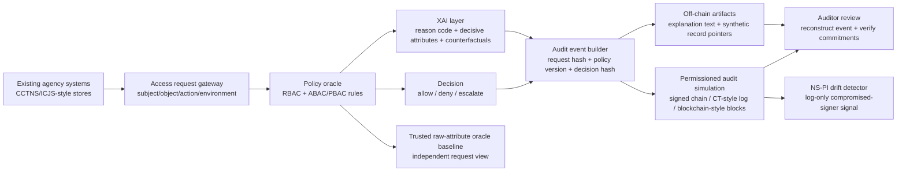
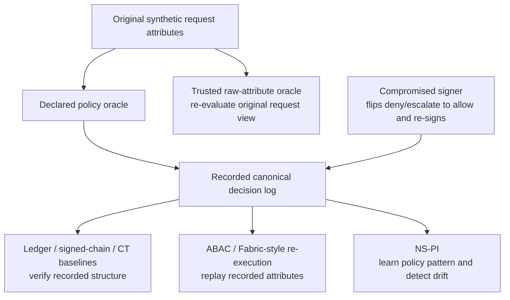

# SEBA-XAI Figure and Table Pack v1

Created: 2026-05-30
Status: paper-facing planning artifact, not final camera-ready figures.

Evidence basis:

- `06_proposed_architecture.md`
- `papers/final_paper/paper_draft_v1.md`
- `results/tables/paper_table_01_method_comparison.csv`
- `results/tables/paper_table_02_tamper_detection.csv`
- `results/tables/paper_table_03_metadata_exposure.csv`
- `results/tables/paper_table_04_latency_storage.csv`
- `results/tables/paper_table_05_policy_ablation.csv`
- `results/tables/full_grid_aas_by_defense.csv`
- `results/tables/full_grid_per_attack.csv`
- `results/tables/seed_confidence_summary.csv`
- `results/tables/workload_policy_stress_summary.csv`
- `results/tables/explanation_audit_quality_summary.csv`

## 1. Purpose

This document translates the current SEBA-XAI evidence into a conservative
figure and table plan for the manuscript. It is designed to make the paper
easy for a reviewer to evaluate without adding unsupported claims.

The pack follows three rules:

1. Every quantitative item must point to an existing result table.
2. Every architecture item must state that raw sensitive records remain
   off-chain and that the ledger stores commitments or metadata only.
3. Every result item must preserve the synthetic-workload boundary.

## 2. Proposed Figures

### Figure 1: SEBA-XAI Overlay Architecture

Paper section: Methodology / System Architecture.

Source artifacts:

- `06_proposed_architecture.md`
- `papers/final_paper/methodology/methodology_draft_v1.md`

Allowed claim:

SEBA-XAI is an overlay for synthetic inter-agency access-governance
evaluation. Existing agency systems keep authoritative raw records; the
prototype evaluates contextual access requests, creates explanation artifacts,
and records audit commitments.

Caveat:

This is not a live CCTNS/ICJS integration and not a deployed Hyperledger
Fabric network.

Draft figure:

Caption note:

Raw sensitive records are off-chain. The audit layer stores request IDs,
hashes, policy/model versions, decision summaries, explanation hashes, and
commitment metadata only.

### Figure 2: Detector Visibility and Threat Model

Paper section: Threat Model / Methodology.

Source artifacts:

- `papers/final_paper/threat_model/threat_model_draft_v1.md`
- `results/tables/full_grid_per_attack.csv`
- `results/tables/seed_confidence_summary.csv`

Allowed claim:

The proposed benchmark separates defenses by what they can see: recorded log
only, independent raw request view, or distribution-level signed decision log.
This explains why ledger baselines catch ordinary tamper cases but miss the
validly re-signed compromised-signer attack.

Caveat:

The trusted raw-attribute oracle is a stronger baseline because it assumes an
independent uncompromised view of the original request attributes.

Draft figure:

Caption note:

Ledger-only baselines see a validly signed corrupted log under the
compromised-signer attacker. NS-PI sees only the log but detects policy
distribution drift in the tested synthetic benchmark. The trusted oracle sees
the original request view and is therefore stronger.

### Figure 3: Compromised-Signer Detection Summary

Paper section: Results.

Source artifacts:

- `results/tables/seed_confidence_summary.csv`
- `results/tables/full_grid_per_attack.csv`

Allowed claim:

Across the five full-grid seeds, ledger-style and ABAC re-execution baselines
detect 0/5 compromised-signer runs, while NS-PI and the trusted raw-attribute
oracle detect 5/5 runs.

Caveat:

This is not a broad security superiority claim. NS-PI is useful under this
specific weak-visibility attacker model and does not replace cryptographic
audit or trusted re-evaluation.

Suggested final format:

Use a compact grouped bar chart or a two-row table in the Results section.

Minimum values to show:

| Defense group | Detection rate | Seeds | Source |
|---|---:|---:|---|
| Ledger / ABAC re-execution baselines | 0.0 | 5 | `results/tables/seed_confidence_summary.csv` |
| NS-PI drift | 1.0 | 5 | `results/tables/seed_confidence_summary.csv` |
| Trusted raw-attribute oracle | 1.0 | 5 | `results/tables/seed_confidence_summary.csv` |

### Figure 4: Sensitivity Boundary for NS-PI

Paper section: Results / Limitations.

Source artifacts:

- `results/tables/seed_confidence_summary.csv`
- `results/tables/nspi_compromised_signer_sensitivity_summary.csv`
- `results/tables/nspi_targeted_compromised_signer_summary.csv`

Allowed claim:

NS-PI detection depends on corruption rate and attack locality. Global NS-PI
misses 2 percent and 5 percent global corruption in the current benchmark, and
grouped station/district checks are needed for localized attacks.

Caveat:

The tested thresholds are synthetic benchmark findings, not deployment
thresholds.

Suggested final format:

Use a line chart for global corruption fractions and a small table for
targeted station/district corruption.

Do not claim:

- a universal minimum detectable attack rate;
- operational robustness;
- privacy or legal guarantees from sensitivity behavior.

### Figure 5: XAI and Audit Reviewability Metrics

Paper section: Results.

Source artifacts:

- `results/tables/explanation_audit_quality_summary.csv`
- `results/tables/seed_confidence_summary.csv`

Allowed claim:

The XAI layer is measurable in the prototype: trace completeness,
counterfactual coverage, counterfactual validity, duplicate-context stability,
and audit reconstruction are recorded across five seeds.

Caveat:

The natural-language explanation renderer is still incomplete because full
decisive-attribute text coverage is below 1.0.

Minimum values to show:

| Metric | Mean | Seeds | Interpretation |
|---|---:|---:|---|
| Trace completeness | 1.000 | 5 | Structured traces exist for all tested requests. |
| Counterfactual coverage | 1.000 | 5 | Counterfactuals are generated for all targeted cases. |
| Counterfactual validity | 0.996 | 5 | Most counterfactuals replay to the intended policy change. |
| Stable decision/reason row rate | 1.000 | 5 | Duplicate policy contexts produce stable decision/reason outputs. |
| Audit reconstruction rate | 1.000 | 5 | Signed-log-to-block joins reconstruct in the tested artifacts. |
| Decisive-attribute full text coverage | 0.781 | 5 | Explanation text still omits some decisive attributes. |

## 3. Proposed Tables

### Table I: Method Comparison

Source artifact:

- `results/tables/paper_table_01_method_comparison.csv`

Use:

Compare RBAC mutable logs, ABAC/PBAC mutable logs, signed hash chains,
blockchain-style audit, and full SEBA-XAI.

Allowed claims:

- RBAC role/action-only baseline has poor agreement with the synthetic policy
  oracle on this workload.
- ABAC/PBAC matches the synthetic policy oracle when rules are aligned.
- Signed hash chains and blockchain-style audit add local tamper-evidence.
- SEBA-XAI adds explanation-hash logging to the ABAC/PBAC and audit path.

Caveat:

Accuracy means agreement with the synthetic policy oracle, not real police
decision correctness.

### Table II: Ordinary Tamper Detection by Audit Artifact

Source artifact:

- `results/tables/paper_table_02_tamper_detection.csv`

Use:

Show controlled local tamper cases for mutable logs, signed hash chains,
blockchain-style blocks, and off-chain pointer/store verification.

Allowed claims:

- Mutable logs do not internally detect valid-looking edits in the controlled
  test.
- Signed hash-chain, blockchain-style, and off-chain anchored pointer checks
  detect their controlled edits in the local prototype.

Caveat:

This does not prove production cryptographic security.

### Table III: Attack Coverage by Defense

Source artifacts:

- `results/tables/full_grid_aas_by_defense.csv`
- `results/tables/full_grid_per_attack.csv`

Use:

Summarize attack-aware score (AAS) and per-attack detection rates for each
defense. Keep the table compact in the main paper and move full per-attack
rows to an appendix if needed.

Allowed claims:

- The trusted raw-attribute oracle has the highest AAS in this benchmark.
- Ledger/ABAC baselines detect ordinary integrity and replay-style attacks
  but miss compromised-signer attacks.
- NS-PI has lower overall AAS because it is specialized for drift, not general
  tamper detection.

Caveat:

AAS is a benchmark score defined by this experiment. It is not an operational
security rating.

### Table IV: Metadata Exposure Comparison

Source artifact:

- `results/tables/paper_table_03_metadata_exposure.csv`

Use:

Compare full-metadata ledger and minimized commitment ledger schemas.

Allowed claim:

The minimized commitment ledger has fewer clear sensitive columns in this
schema-level comparison.

Caveat:

This is not a formal privacy proof and does not measure re-identification
risk.

### Table V: Latency and Storage Overhead

Source artifact:

- `results/tables/paper_table_04_latency_storage.csv`

Use:

Report local p50 build/decision and verification times, plus storage per event
or request.

Allowed claim:

The prototype records local Python timing and storage overhead for the
synthetic workload.

Caveat:

These are local prototype measurements, not production Fabric or CCTNS/ICJS
performance measurements.

### Table VI: Policy Ablation

Source artifact:

- `results/tables/paper_table_05_policy_ablation.csv`

Use:

Show why contextual ABAC/PBAC rules matter by removing approval, assignment,
sealed-record, privacy, jurisdiction, sensitivity, emergency/network, and
fallback-review rules.

Allowed claim:

Removing substantive policy groups creates errors relative to the full
configured synthetic policy.

Caveat:

The reference is the declared synthetic policy oracle, not validated official
police policy.

### Table VII: Workload and Policy-Mix Stress

Source artifacts:

- `results/tables/workload_policy_stress_summary.csv`
- `results/tables/seed_confidence_summary.csv`

Use:

Show workload-size and policy-mix stress rows, especially the 25 percent and
10 percent compromised-signer cases.

Allowed claims:

- The 25 percent compromised-signer asymmetry holds across the tested workload
  sizes and policy-mix arms in the current stress summary.
- At 10 percent corruption, NS-PI behavior is workload-size dependent in the
  current stress summary.

Caveat:

The stress table now uses the same five-seed set as the full-grid,
sensitivity, and XAI summaries. The remaining caveat is not seed count; it is
that 10 percent compromised-signer detection is workload-size dependent.

## 4. Main-Paper Versus Appendix Recommendation

Recommended main-paper figures:

1. Figure 1: SEBA-XAI overlay architecture.
2. Figure 2: detector visibility and threat model.
3. Figure 3: compromised-signer detection summary.
4. Figure 5: XAI and audit reviewability metrics.

Recommended main-paper tables:

1. Table I: method comparison.
2. Table III: attack coverage by defense.
3. Table VI: policy ablation.
4. Table VII: workload/policy-mix stress.
5. One compact sensitivity-boundary figure from
   `results/tables/nspi_compromised_signer_sensitivity_summary.csv` if page
   budget allows.

Recommended appendix material:

- Table II: ordinary tamper detection by audit artifact.
- Table IV: metadata exposure comparison.
- Table V: latency and storage overhead.
- Full per-attack rows from `results/tables/full_grid_per_attack.csv`.
- Full seed-confidence rows from `results/tables/seed_confidence_summary.csv`.

## 5. Figures and Tables To Avoid

Do not include these unless new evidence is generated:

| Unsupported artifact | Why to avoid it |
|---|---|
| Real CCTNS/ICJS deployment diagram | The prototype is not integrated with live government infrastructure. |
| Production Hyperledger Fabric topology | The audit layer is a local file-backed permissioned-chain simulation. |
| Real police-record data-flow diagram | The benchmark uses synthetic requests and no actual police records. |
| Privacy-guarantee chart | Metadata minimization was measured only at schema level. |
| Legal admissibility figure | No legal expert validation or evidentiary admissibility experiment exists. |
| SOTA comparison chart | The benchmark is custom and does not establish state-of-the-art performance. |

## 6. Immediate Editing Checklist

Before IEEE formatting:

- Convert Figure 1 and Figure 2 from Mermaid planning diagrams into clean
  paper figures.
- Choose one result visualization for the compromised-signer finding and one
  for XAI/audit reviewability.
- State in Table VII captions that stress results are five-seed synthetic
  benchmark results and that 10 percent detection remains workload-size
  dependent.
- Make every caption include either "synthetic workload" or "local prototype"
  where relevant.
- Keep raw-record-off-chain wording in the architecture caption.
- Do not present local latency as production blockchain latency.

## 7. Claude Review Notes Folded Into This Pack

The Claude review agreed with the conservative direction and added three useful
caption guardrails:

- every table or figure caption should name the source CSV path;
- avoid latency or throughput graphics that imply production infrastructure
  performance;
- avoid any ranked "AAS leaderboard" visual because it could imply that NS-PI
  is a general detector, even though its measured value is attack-specific.
