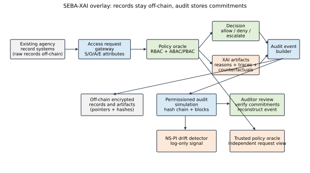
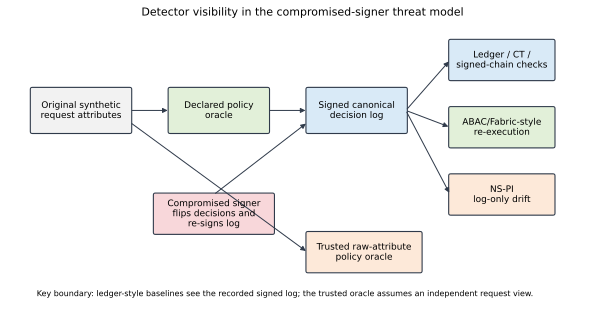
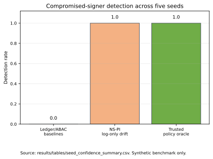
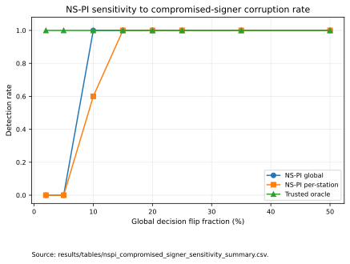
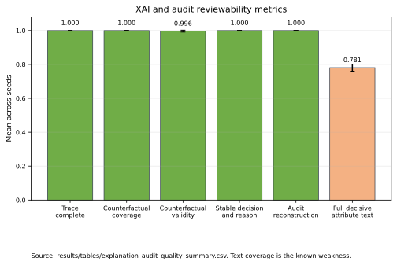
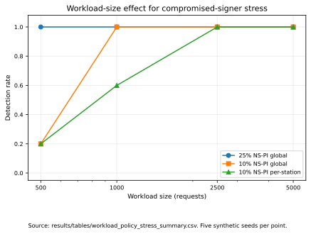

# SEBA-XAI: Explainable Policy-Drift Detection for Blockchain-Audited Police Access Governance

Created: 2026-05-30
Status: combined manuscript draft v1; not final IEEE prose.
Evidence basis: this draft is assembled from the current section drafts under
`papers/final_paper/`, the working reference map
`papers/final_paper/references_ieee_map.md`, and measured artifacts under
`results/tables/`.

## Abstract

SEBA-XAI is a research prototype for explainable, blockchain-audited access
governance over sensitive police and criminal-justice records. The paper
studies a synthetic CCTNS/ICJS-style inter-agency access workflow in which
requests are evaluated by contextual policy rules, recorded through signed and
blockchain-style audit commitments, and reviewed through structured
explanation artifacts. The evaluation compares ledger-only integrity,
ABAC-style re-execution, a trusted raw-attribute policy oracle, and NS-PI, an
interpretable policy-drift detector. The results show that NS-PI is not the
best overall tamper detector and does not replace trusted policy
re-evaluation. Its useful role is narrower: it detects validly re-signed
compromised-signer logs in the synthetic benchmark where ledger-only baselines
are blind by construction. The paper also reports XAI/audit reviewability
metrics, sensitivity boundaries, workload-size effects, and limitations. All
results are synthetic benchmark evidence, not operational evidence.

Keywords: access control, blockchain audit, explainable AI, police data
governance, CCTNS, ICJS, policy drift, synthetic benchmark

## I. Introduction

India's police and criminal-justice information systems already operate at
national scale. The Crime and Criminal Tracking Network and Systems (CCTNS)
provides a digital backbone for police processes, and an official Press
Information Bureau release reports that all 17,798 police stations were using
CCTNS as of 2026-02-01 [1]. The same source describes support for FIRs,
chargesheets, state-hosted application deployment, replication to a National
Data Centre, search of crime, criminal, and property information, standardized
Integrated Investigation Forms, and master codes for states, districts, police
stations, acts, and sections [1]. The Inter-Operable Criminal Justice System
(ICJS) further connects police/CCTNS with courts, prisons, forensics, and
prosecution through a Data Sharing Matrix [2]. This paper therefore treats
CCTNS/ICJS as the institutional baseline. The research problem is not to
replace those systems, but to study an additional access-governance overlay
for sensitive inter-agency record requests.

Inter-agency access to police and criminal-justice records is not an ordinary
database-query problem. Records may include FIR details, witness and victim
information, juvenile records, forensic reports, cybercrime complaints, case
diary material, evidence references, and court or prosecution-linked records.
A requester's organization or broad role is not enough to justify disclosure.
The decision may depend on role, rank, station, jurisdiction, case assignment,
purpose, record sensitivity, credential status, approval state, time window,
emergency context, and whether the request is connected to court, prosecution,
or forensic workflow. The system must decide whether to allow, deny, or
escalate a request, and an auditor must later reconstruct what was requested,
which policy version was used, which attributes mattered, what explanation was
generated, and who approved or reviewed the event.

SEBA-XAI treats blockchain audit, security/access control, and explainable AI
as equal pillars of this problem. Blockchain is useful here only in a limited
role: it can support tamper-evident audit commitments across known agencies,
not store raw sensitive records or make records private by itself. NISTIR 8403
discusses blockchain access-control systems and their implementation
considerations [4], while Hyperledger Fabric is a relevant reference point for
permissioned blockchain among known organizations [5]. Security and privacy
still require contextual policy enforcement, off-chain storage, minimization,
encryption, and metadata controls. NIST SP 800-162 defines ABAC using subject,
object, action, and environmental attributes evaluated against policy rules or
relationships [3].

The explainability pillar is equally central because access recommendations in
public-safety workflows must be reviewable by officers, superiors, auditors,
and possibly court or prosecution stakeholders. In this paper, XAI is not a
dashboard decoration. It is a logged artifact: the system preserves the
decision label, reason code, decisive policy attributes, policy version, model
or rule version, counterfactual information where applicable, and hashes that
bind explanations to audit events. This framing follows arguments for
interpretable models in high-stakes settings [9] and recent law-enforcement
XAI work emphasizing stakeholder needs, AI literacy, and automation-bias risk
[10]. It also avoids individual predictive policing as the primary problem.
Prior work shows how predictive-policing feedback loops can reinforce model
attention through reported or observed incidents [11], and public NCRB crime
data is aggregate reported/registered crime context rather than public
individual police-record access data [12].

Existing research covers parts of this problem but not the full workflow
evaluated here. Blockchain has been proposed for digital crime evidence
management and lawful chain-of-custody workflows [7], [8]. Fabric-based ABAC
and encrypted off-chain data sharing have been studied in generic contexts
[6]. XAI and fairness research has identified high-stakes explanation needs
and the risks of overclaiming criminal-justice prediction systems [9]-[11].
The gap is narrower than "AI for police data": there is limited reproducible
work on a CCTNS/ICJS-compatible access-governance overlay that jointly
evaluates contextual authorization, superior-review style escalation,
off-chain sensitive-record commitments, blockchain-style audit, explanation
artifact logging, adversarial audit attacks, and explanation reviewability.

To address this gap, we propose SEBA-XAI, a Secure, Explainable,
Blockchain-Audited access-governance overlay for sensitive inter-agency police
record sharing. The implemented research prototype uses synthetic
CCTNS/ICJS-style access requests, a deterministic declared policy oracle, a
file-backed permissioned-chain audit simulation, signed hash-chain and CT-style
log baselines, ABAC/Fabric-style re-execution baselines, a trusted
raw-attribute policy oracle baseline, and NS-PI, an interpretable
neuro-symbolic policy-induction and drift-detection component. Raw sensitive
records remain off-chain; the audit layer stores commitments and metadata for
requests, decisions, policies, approvals, model or rule versions, and
explanation artifacts.

This paper makes five contributions. First, it formulates a CCTNS/ICJS-
compatible access-governance problem for sensitive inter-agency police and
criminal-justice records. Second, it implements a SEBA-XAI research prototype
combining off-chain records, contextual access policy, blockchain-style audit
commitments, and logged XAI artifacts. Third, it introduces an adversarial
audit benchmark covering ordinary tamper attacks, metadata-inference style
checks, and validly re-signed compromised-signer attacks. Fourth, it evaluates
NS-PI against ledger-only, ABAC/Fabric-style, and trusted raw-attribute oracle
baselines, showing both its useful compromised-signer signal and its
low-rate/targeted sensitivity limits. Fifth, it measures XAI and audit
reviewability through trace completeness, decisive-attribute text coverage,
counterfactual coverage and validity, duplicate-context stability, and
signed-log-to-block audit reconstruction.

## II. Related Work

The Indian baseline is not a missing data infrastructure. Official CCTNS and
ICJS sources establish national-scale police digitization and inter-pillar
criminal-justice integration [1], [2]. These sources define the institutional
surface that any audit or access-control proposal must respect. They are not,
however, open research artifacts and do not provide reproducible
access-decision workloads or instrumented explanation logs. SEBA-XAI is
therefore positioned as an overlay for auditable authorization, provenance,
privacy, and explainable review.

A line of blockchain work records evidence lifecycle events and access
provenance. Two-level blockchain evidence management and LEChain support the
relevance of hot/cold or on-chain/off-chain evidence handling [7], [8]. A
Fabric-based digital evidence management model and cross-organization
auditable access-control work provide additional implementation precedents
[13], [14]. Hyperledger Fabric motivates the permissioned-chain direction for
known agencies [5]. The blockchain access-control survey and NISTIR 8403
constrain novelty claims by showing that blockchain access-control patterns
and cautions already exist [4], [15].

Security, privacy, and access-control research provides the policy vocabulary
for SEBA-XAI. NIST SP 800-162 grounds ABAC in subject, object, action, and
environment attributes [3]. Fabric+ABAC work shows that chaincode can enforce
fine-grained attribute policies with encrypted off-chain storage and on-chain
references [6]. Accountable and privacy-preserving blockchain-based access
control, privacy-preserving ML surveys, and differentially private learning
provide adjacent methods and future-extension paths [16]-[18]. The current
prototype does not propose a new cryptographic scheme; it compares
ledger-style audit, ABAC re-execution, trusted policy re-evaluation, and
log-only drift detection under explicit visibility assumptions.

XAI, fairness, and high-stakes AI literature provide the caution needed for
this domain. Rudin argues for interpretable models where feasible in
high-stakes settings [9]. Criminal-justice AI and fairness work warns against
overclaiming risk prediction and identifies fairness trade-offs [19]-[21].
Predictive-policing feedback-loop work justifies avoiding individual crime or
criminal prediction as the central task [11]. Recent law-enforcement XAI work
emphasizes stakeholder-specific explanations and automation-bias risk [10],
while related XAI, legal-AI audit, blockchain-XAI-justice, India crime-XAI, and
legal-NLP references show the adjacent space [22]-[28]. SEBA-XAI differs by
treating explanation traces and counterfactuals as logged audit artifacts in a
synthetic inter-agency access-control benchmark.

## III. Methodology

SEBA-XAI is evaluated as a synthetic-workload research prototype. The overlay
contains a request gateway, a declared policy oracle, an explanation layer, and
a permissioned audit layer above existing agency record systems, following the
architecture in `06_proposed_architecture.md`. Raw records remain off-chain;
the audit layer stores only decision summaries, hash commitments, anchor
hashes, and metadata required for review. This is a benchmark instrument, not
an operational integration.

Synthetic requests are generated by
`prototype/synthetic_access_sim/generate_synthetic_requests.py` and driven by
the full-grid and stress scripts. Each request includes subject, object, and
environment attributes such as role, rank, station, jurisdiction, case
assignment, credential status, sensitivity, sealed/juvenile/witness flags,
time window, purpose, emergency flag, court/prosecutor flag, and policy
version. The integer seed controls randomness; the full-grid experiments and
the workload/policy-mix stress matrix use five seeds
`{7, 21, 42, 99, 123}`.

The declared policy oracle in
`prototype/synthetic_access_sim/policy_oracle.py` labels each synthetic request
as `allow`, `deny`, or `escalate`. It also emits a reason code, decisive
attributes, a decision hash, an explanation hash, and an audit anchor hash.
The oracle is the benchmark labeling function, not a claim of real-world
policy correctness.

The prototype implements a mutable log baseline, a signed append-only
hash-chain, a CT-style log, a permissioned blockchain-style file-backed audit
layer, Fabric-style ABAC re-execution, plain ABAC re-execution, a trusted
raw-attribute policy oracle, and NS-PI. The blockchain-style layer is
implemented by `prototype/synthetic_access_sim/blockchain_audit.py` and emits
`block_event_index.csv` and `permissioned_audit_blocks.jsonl` artifacts under
prototype run directories. It is a local simulation of permissioned audit
commitments, not a live Fabric network.

The attack catalog includes ordinary tamper cases such as approval-token
replay, request backdating, explanation-hash substitution, block-signature
collusion, revocation races, and metadata-inference checks. The decisive
attacker is `compromised_signer`, implemented in
`src/seba/attacks/compromised_signer.py`. This attacker flips a configurable
fraction of `deny` or `escalate` decisions to `allow` and re-signs the log, so
ledger-only integrity checks pass by construction.

NS-PI learns an interpretable policy view from the declared policy behavior
and applies distribution-level drift tests to the signed decision log. It has
log-only visibility and does not verify individual rows. The trusted
raw-attribute policy oracle is stronger: it assumes an independent,
uncompromised view of the original request attributes and re-evaluates policy
row by row. These two detectors are deliberately separated because their trust
assumptions are different.

XAI and audit reviewability are evaluated through trace completeness,
decisive-attribute text coverage, counterfactual coverage, counterfactual
validity, duplicate-context stability, and audit reconstruction. The
seed-confidence aggregator `scripts/run_seed_confidence_summary.py`
consolidates mean, sample standard deviation, min, and max across existing
per-seed tables. It does not run new experiments.

## IV. Threat Model

The protected assets are the correctness of recorded access decisions, the
integrity of the append-only audit record, the reviewability of each decision
through its explanation and audit trail, and the confidentiality of sensitive
metadata in the published ledger view. The requesting officer is untrusted;
request legitimacy depends on contextual policy attributes. The declared
policy oracle is trusted only as the synthetic benchmark labeler.

The key visibility distinction is central. Ledger integrity and ABAC
re-execution baselines see the recorded canonical log. The trusted
raw-attribute policy oracle sees an independent raw request view. NS-PI sees
only the signed decision log. Therefore, NS-PI should be read as a weak-vision
log-only drift signal, not as a stronger verifier than an independent policy
oracle.

Ordinary tamper attacks modify the audit stream without controlling signing
keys. In that setting, hash-chain, blockchain-style, CT-style, and ABAC-style
checks are expected to work because the attacker breaks a commitment or alters
a value that policy re-execution recomputes. The compromised-signer attacker is
different: it controls the signing authority or enforcement node, corrupts
policy output, and re-signs a valid-looking log. This modeled attacker creates
the blind spot studied in the Results section.

The paper does not assert correctness on actual police records, operational
integration, legal admissibility of the audit trail, formal privacy properties,
or broader comparative claims beyond the implemented baselines.

## V. Results

All results are on synthetic workloads. The full-grid, sensitivity,
explanation-quality, and workload/policy-mix stress experiments use five
seeds. The per-seed records are in
`results/tables/full_grid_raw.csv`, and consolidated across-seed values are in
`results/tables/seed_confidence_summary.csv`.

The overall Adversarial Audit Score (AAS) from
`results/tables/full_grid_aas_by_defense.csv` shows that the trusted
raw-attribute policy oracle is strongest with mean 1.0000/std 0.0000.
ABAC/Fabric-style and ledger-style integrity defenses have mean 0.7917/std
0.0000. The mutable log has mean 0.5000/std 0.0000. NS-PI has mean 0.2500/std
0.0932. This means NS-PI is not the overall tamper detector; its value must be
reported only in the specific attack regime where it contributes.

For ordinary field-modifying attacks, the signed hash-chain,
blockchain-style audit, CT-style log, Fabric+ABAC, and ABAC re-execution
defenses detect the expected changes, as recorded in
`results/tables/full_grid_per_attack.csv`. This control result matters because
it shows that the integrity baselines are functioning before the paper studies
their compromised-signer blind spot.

The decisive result concerns `compromised_signer`. In
`results/tables/seed_confidence_summary.csv`, for family
`detection_compromised_signer`, `signed_chain`, `blockchain_style`, `ct_log`,
`fabric_abac`, `abac_reexec`, and `mutable_log` each have detection mean
0.0/std 0.0 across five seeds. `nspi_drift` and `trusted_policy_oracle` each
have detection mean 1.0/std 0.0. The interpretation is narrow: the oracle
detects because it has an independent raw request view, while NS-PI detects
because the signed decision distribution shifts away from learned policy
behavior. NS-PI is therefore complementary to ledger audit, not a replacement
for it.

The sensitivity studies show where the NS-PI signal becomes weak. From
`results/tables/nspi_compromised_signer_sensitivity_summary.csv`, NS-PI global
and per-station detection are both 0.0 at 2% and 5% global flip fractions,
while the trusted oracle remains 1.0. At 10%, global NS-PI detection reaches
1.0 but per-station detection has mean 0.6 and std 0.547723 in
`results/tables/seed_confidence_summary.csv`. From
`results/tables/nspi_targeted_compromised_signer_summary.csv`, grouped
station/district drift misses 10% targeted corruption, while the trusted
oracle still detects. These are benchmark boundaries, not portable operating
thresholds.

The XAI layer is measured rather than only described. From
`results/tables/explanation_audit_quality_summary.csv` and the
`xai_audit_quality` family of `results/tables/seed_confidence_summary.csv`,
trace completeness, counterfactual coverage, duplicate-context stability, and
audit reconstruction each have mean 1.000000/std 0.000000 across five seeds.
Counterfactual validity has mean 0.996413/std 0.005470. The measurable
weakness is decisive-attribute full text coverage, with mean 0.781000/std
0.020833. Thus, the structured trace is complete, but the natural-language
explanation text still fails to surface every decisive attribute.

The workload/policy-mix stress matrix in
`results/tables/workload_policy_stress_summary.csv` shows that the 25%
compromised-signer asymmetry is stable across the evaluated size and
policy-mix cells: signed-chain detection remains 0.0, while NS-PI global drift
and the trusted oracle remain 1.0. At a 10% flip, workload size matters. From
the `workload_stress` family in `results/tables/seed_confidence_summary.csv`,
NS-PI global drift is inconsistent at N=500, reaches 1.0 from N=1000 onward,
and per-station drift is unstable until N=2500. The stress evidence is
descriptive and should not be treated as an operational threshold.

## VI. Limitations and Future Work

The current evaluation is synthetic. The workload generator supports
controlled reproducibility and adversarial testing, but it does not establish
field performance, institutional acceptance, or procedural fit inside any
government system. The declared policy oracle is a deterministic benchmark
labeler, not a validated representation of official policing or court
procedure.

The main compromised-signer result depends on a modeled attacker. The
benchmark shows the mechanical detection asymmetry; it does not measure how
often signer or enforcement-node compromise occurs. The trusted raw-attribute
policy oracle is also a strong baseline because it assumes an independent,
uncompromised request view. If that view exists, it is stronger than NS-PI. If
only the signed log is available, NS-PI supplies a weaker but still useful
distribution-level signal.

NS-PI has clear sensitivity limits. It misses 2% and 5% global corruption in
the current benchmark and misses 10% targeted station/district corruption. Its
low-rate behavior is workload-size dependent. These limits are not side notes;
they define where log-only drift detection is useful and where independent
policy re-evaluation remains necessary.

The XAI layer also has a visible weakness. The structured trace is complete,
but the natural-language explanation renderer surfaces every decisive
attribute in only 0.781000 of evaluated cases on average. Future work should
improve explanation rendering, add stronger metadata-leakage experiments,
and evaluate a separate real permissioned blockchain test network if
infrastructure performance is later studied.

## VII. Conclusion

SEBA-XAI frames secure inter-agency access governance as a combined audit,
policy, and explanation problem. The prototype does not replace CCTNS/ICJS and
does not put raw sensitive records on-chain. It studies a controlled overlay in
which synthetic access requests are evaluated by a declared policy oracle,
recorded through signed and blockchain-style audit commitments, and reviewed
through structured explanation artifacts.

The evidence-backed result is narrow but useful. Ordinary ledger and
ABAC-style defenses are stronger than NS-PI for ordinary tamper attacks, and
the trusted raw-attribute policy oracle is the strongest overall baseline.
However, for validly re-signed compromised-signer logs, ledger-only and
audit-only baselines are blind by construction, while both NS-PI and the
trusted oracle detect the corruption across the five full-grid seeds. This
supports framing NS-PI as a complementary log-only policy-drift signal under
weaker auditor visibility.

The final claim is conservative: SEBA-XAI shows how permissioned audit
commitments, contextual access control, trusted policy re-evaluation, and
interpretable drift monitoring can be evaluated together for sensitive
inter-agency access governance. The current prototype provides a reproducible
benchmark and paper-ready evidence for that claim, while leaving operational
integration, formal privacy analysis, and domain-validated policy rules as
future work.

## References

[1] Press Information Bureau, Government of India, "CCTNS operational police
stations," Mar. 11, 2026. [Online]. Available:
https://www.pib.gov.in/PressReleasePage.aspx?PRID=2238241. Accessed:
May 30, 2026.

[2] Ministry of Home Affairs, Government of India, "ICJS/NCRB administration."
[Online]. Available: https://www.mha.gov.in/en/commoncontent/icjsncrb-administration.
Accessed: May 30, 2026.

[3] National Institute of Standards and Technology, "Guide to Attribute Based
Access Control (ABAC) Definition and Considerations," NIST SP 800-162, 2014.
[Online]. Available: https://csrc.nist.gov/pubs/sp/800/162/upd2/final.
Accessed: May 30, 2026.

[4] National Institute of Standards and Technology, "Blockchain for access
control systems," NISTIR 8403, 2022, doi: 10.6028/NIST.IR.8403.

[5] E. Androulaki et al., "Hyperledger Fabric: A distributed operating system
for permissioned blockchains," 2018. [Online]. Available:
https://arxiv.org/abs/1801.10228. Accessed: May 30, 2026.

[6] X. Zhao, S. Wang, Y. Zhang, and Y. Wang, "Attribute-based access control
scheme for data sharing on Hyperledger Fabric," Journal of Information
Security and Applications, vol. 67, Art. no. 103182, 2022,
doi: 10.1016/j.jisa.2022.103182.

[7] D. Kim, S.-Y. Ihm, and Y. Son, "Two-level blockchain system for digital
crime evidence management," Sensors, vol. 21, no. 9, Art. no. 3051, 2021,
doi: 10.3390/s21093051.

[8] M. Li, C. Lal, M. Conti, and D. Hu, "LEChain: A blockchain-based lawful
evidence management scheme for digital forensics," Future Generation Computer
Systems, 2021, doi: 10.1016/j.future.2020.09.038.

[9] C. Rudin, "Stop explaining black box machine learning models for high
stakes decisions and use interpretable models instead," Nature Machine
Intelligence, 2019, doi: 10.1038/s42256-019-0048-x.

[10] M. Zocholl, D. Stampouli, M. Wittfoth, and G. Mounier, "Fundamental
considerations for the use of explainable AI in law enforcement," Frontiers in
Political Science, vol. 7, Art. no. 1605619, 2025,
doi: 10.3389/fpos.2025.1605619.

[11] D. Ensign, S. A. Friedler, S. Neville, C. Scheidegger, and
S. Venkatasubramanian, "Runaway feedback loops in predictive policing," in
Proc. FAT, 2018. [Online]. Available:
https://proceedings.mlr.press/v81/ensign18a.html. Accessed: May 30, 2026.

[12] National Crime Records Bureau / data.gov.in, "Crime in India 2023."
[Online]. Available: https://www.data.gov.in/catalog/crime-india-2023.
Accessed: May 30, 2026.

[13] J. Jeong, D. Kim, B. Lee, and Y. Son, "Design and implementation of a
digital evidence management model based on Hyperledger Fabric," Journal of
Information Processing Systems, vol. 16, no. 4, pp. 760-773, 2020,
doi: 10.3745/JIPS.04.0178.

[14] A. Akhtar, B. Shafiq, J. Vaidya, A. Afzal, S. Shamail, and O. Rana,
"Blockchain based auditable access control for distributed business processes,"
in Proc. IEEE 40th International Conference on Distributed Computing Systems
(ICDCS), 2020, pp. 12-22, doi: 10.1109/ICDCS47774.2020.00015.

[15] S. Rouhani and R. Deters, "Blockchain based access control systems: State
of the art and challenges," arXiv:1908.08503, 2019. [Online]. Available:
https://arxiv.org/abs/1908.08503. Accessed: May 30, 2026.

[16] Q. Hu, C. Huang, G. Zhang, L. Cai, and T. Jiang, "Towards accountable and
privacy-preserving blockchain-based access control for data sharing," Journal
of Information Security and Applications, vol. 85, Art. no. 103866, 2024,
doi: 10.1016/j.jisa.2024.103866.

[17] R. Xu, N. Baracaldo, and J. Joshi, "Privacy-preserving machine learning:
Methods, challenges and directions," arXiv:2108.04417, 2021. [Online].
Available: https://arxiv.org/abs/2108.04417. Accessed: May 30, 2026.

[18] M. Abadi, A. Chu, I. Goodfellow, H. B. McMahan, I. Mironov, K. Talwar,
and L. Zhang, "Deep learning with differential privacy," in Proc. ACM SIGSAC
Conference on Computer and Communications Security, 2016, pp. 308-318,
doi: 10.1145/2976749.2978318.

[19] J. Dressel and H. Farid, "The accuracy, fairness, and limits of predicting
recidivism," Science Advances, 2018, doi: 10.1126/sciadv.aao5580.

[20] A. Chouldechova, "Fair prediction with disparate impact: A study of bias
in recidivism prediction instruments," Big Data, vol. 5, no. 2, pp. 153-163,
2017, doi: 10.1089/big.2016.0047.

[21] J. Kleinberg, S. Mullainathan, and M. Raghavan, "Inherent trade-offs in
the fair determination of risk scores," arXiv:1609.05807, 2016. [Online].
Available: https://arxiv.org/abs/1609.05807. Accessed: May 30, 2026.

[22] F. Beer, D. Mindlin, S. Kost, I. Krause, K. Schwarz, K. Seidensticker,
P. Cimiano, and E. Esposito, "Dialogue-based XAI for predictive policing: A
field study," in xAI 2025 Late-breaking Work, Demos, Doctoral Consortium,
CEUR Workshop Proceedings, vol. 4017, pp. 17-24, 2025. [Online]. Available:
https://ceur-ws.org/Vol-4017/paper_03.pdf. Accessed: May 30, 2026.

[23] S. Sachan and X. Liu (Lisa), "Blockchain-based auditing of legal decisions
supported by explainable AI and generative AI tools," Engineering Applications
of Artificial Intelligence, vol. 129, Art. no. 107666, 2024,
doi: 10.1016/j.engappai.2023.107666.

[24] K. Demertzis, K. Rantos, L. Magafas, C. Skianis, and L. Iliadis, "A secure
and privacy-preserving blockchain-based XAI-justice system," Information,
vol. 14, no. 9, Art. no. 477, 2023, doi: 10.3390/info14090477.

[25] R. Sharma and U. Gupta, "Analysis of criminal spatial events in India
using exploratory data analysis and regression," Computers and Electrical
Engineering, vol. 109, Art. no. 108761, 2023,
doi: 10.1016/j.compeleceng.2023.108761.

[26] A. S. Naick, R. C. Poonia, and A. Sharma, "Forecasting murder motives in
India using statistical analysis and explainable artificial intelligence," in
Proc. IEEE Uttar Pradesh Section International Conference on Electrical,
Electronics and Computer Engineering (UPCON), 2024, pp. 1-6,
doi: 10.1109/UPCON62832.2024.10983398.

[27] M. A. Reza, A. Bisaria, S. Advaitha, A. Ponnekanti, and A. Arya, "CriX:
Intersection of crime, demographics and explainable AI," in Proc. 17th
International Conference on Agents and Artificial Intelligence (ICAART), vol. 2,
2025, pp. 714-725, doi: 10.5220/0013316200003890.

[28] S. Deshmukh and P. Kamble, "IndianBailJudgments-1200: A multi-attribute
dataset for legal NLP on Indian bail orders," arXiv:2507.02506, 2025,
doi: 10.48550/arXiv.2507.02506.
